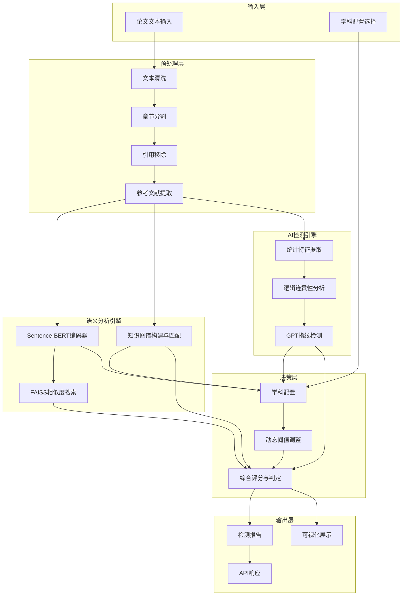
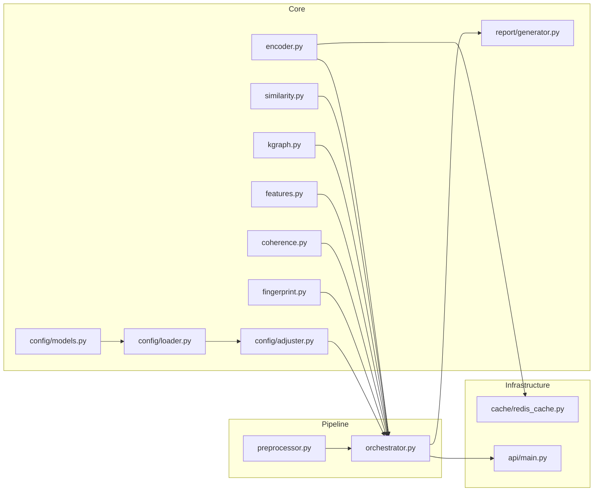

# 语义级论文查重系统 — 架构文档

## 系统概述

语义级论文查重系统（Semantic Thesis Plagiarism Detection System）是一个基于深度学习和知识图谱的智能查重平台。与传统查重系统仅检测字面重复不同，本系统能够识别**语义级相似**和**观点抄袭**，并具备**AI生成内容检测**能力。

## 系统架构



## 模块依赖关系



## 关键技术点

### 1. BERT 语义向量化

- **模型**: Sentence-BERT (`all-MiniLM-L6-v2`)
- **向量维度**: 384
- **编码方式**: 句子级编码，支持批量处理
- **缓存策略**: Redis 缓存已编码向量，避免重复计算
- **相似度度量**: 余弦相似度，通过 FAISS IndexFlatIP 加速搜索

### 2. 知识图谱构建

- **图数据库**: NetworkX (内存图)
- **节点**: 学科关键词 + TF-IDF 提取实体
- **边**: 共现关系（5句滑动窗口）
- **匹配算法**: 子图同构 + 图编辑距离
- **用途**: 检测观点抄袭和论证结构相似

### 3. AI 生成内容检测

| 特征 | 方法 | AI生成文本特点 |
|------|------|----------------|
| 突发性 | 句子长度变异系数 | 较低（长度均匀） |
| 词汇熵 | 香农熵 | 可能异常偏高或偏低 |
| 过渡词分布 | 分类统计+多样性 | 类别分布不均衡 |
| 困惑度 | GPT-2 / 近似n-gram | 较低（更可预测） |
| 重复率 | n-gram重复分析 | 异常模式 |

### 4. 学科定制化

每个学科有独立的 JSON 配置文件，包含：

- **引用配置**: 最大引用占比、最低新发现要求
- **相似度配置**: 语义/字面阈值、知识图谱权重
- **AI检测配置**: 特征权重、集成阈值

## 数据流

```
论文输入
  │
  ▼
文本预处理 ──→ 章节分割 → 引用移除 → 参考文献提取
  │
  ├──→ [语义查重路径]
  │     ├── BERT编码 → FAISS索引 → 语义相似度
  │     ├── 知识图谱构建 → 图匹配 → 观点抄袭评分
  │     └── n-gram字面相似度
  │
  ├──→ [AI检测路径]
  │     ├── 统计特征提取（熵、突发性、TTR等）
  │     ├── 逻辑连贯性分析（过渡词、局部/全局连贯性）
  │     └── 指纹检测（重复率、概率分布）
  │
  └──→ [决策路径]
        ├── 加载学科配置
        ├── 动态阈值调整
        ├── 加权综合评分
        └── 判定 + 报告生成
```

## 缓存策略

- **一级缓存**: Redis（配置启用时）
  - Key 格式: `emb:{model_name}:{text_md5}`
  - TTL: 3600 秒（可配置）
  - 淘汰策略: LRU
- **二级缓存**: 内存字典（Redis不可用时自动降级）
- **缓存内容**: 语义向量（numpy 数组序列化）

## 部署要求

- **Python**: 3.11+
- **内存**: 至少 4GB（加载 BERT 模型）
- **可选依赖**: Redis（缓存加速）、GPU（模型推理加速）
- **模型**: Sentence-Transformers（首次运行自动下载）